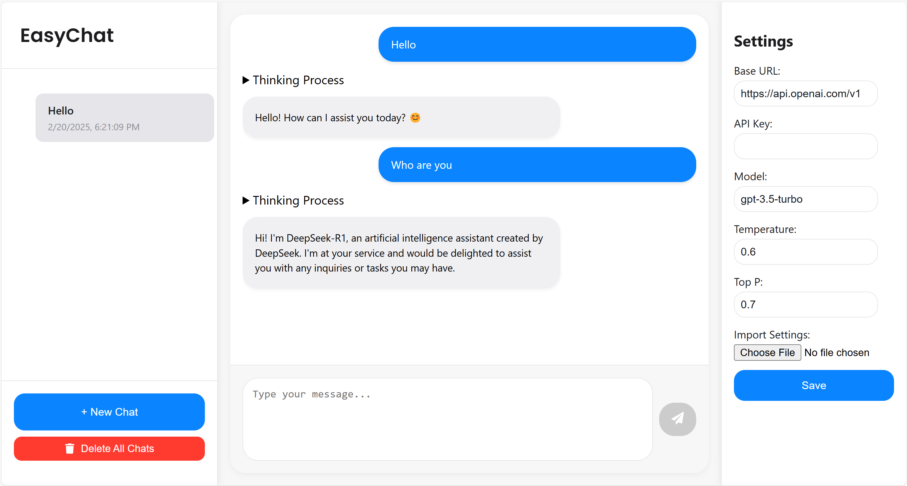

# EasyChat 🚀

[](https://www.python.org/) [](https://flask.palletsprojects.com/) [](https://reactjs.org/)

**EasyChat** is a local chatbot web application built with Flask and React. It offers a delightful and modern interface for interacting with a language model (LLM) API of your choice. With its streamlined conversation management and real-time streaming capabilities, EasyChat is perfect for local experimentation and development.



---

## Table of Contents

- [Overview](#overview)
- [Key Features](#key-features)
- [Installation (Linux)](#installation-linux)
  - [Prerequisites](#prerequisites)
  - [Clone the Repository](#clone-the-repository)
  - [Set Up the Frontend](#set-up-the-frontend)
  - [Set Up the Backend](#set-up-the-backend)
  - [Running the Application](#running-the-application)
- [Configuration](#configuration)
  - [Example JSON File for Import Settings](#example-json-file-for-import-settings)
- [Local Data Storage](#local-data-storage)
- [Contributing](#contributing)
- [Contact](#contact)

---

## Overview

EasyChat is designed to help you set up a local chatbot that communicates with any LLM API seamlessly. The app features a clean separation between the frontend and backend, ensuring ease of customization and extension. Whether you're a developer experimenting with LLMs or looking for a personal chatbot, EasyChat has you covered.

---

## Key Features

- **💬 Chat Interface:** Enjoy a dynamic, real-time chat experience with a modern React-based UI.
- **🗂️ Conversation Management:** Easily create, rename, and delete chats.
- **⚙️ Customizable API Settings:** Configure your LLM API (base URL, API key, model, temperature, top_p) directly from the user interface.
- **🖥️ Local Deployment:** Perfect for Linux-based development environments.

---

## Installation (Linux)

Follow these steps to install and run EasyChat on your Linux system.

### Prerequisites

Ensure that you have the following installed (on all platforms including Windows, MacOS, and Linux):

- **Git**
- **Node.js** and **npm**
- **Python 3**
- **pip**

### Clone the Repository

Open your terminal and run:

```bash
git clone https://github.com/kaikaiyao/easy_chat.git
cd easy_chat
```

### Set Up the Frontend

Navigate to the `frontend` directory, install the npm dependencies, and build the project:

```bash
cd frontend
npm install
npm run build
```

### Set Up the Backend

Navigate to the `backend` directory and install the required Python packages:

```bash
cd ../backend
pip install -r requirements.txt
cd ..
```

So far, the installation is finished.

### Running the Application

By default, the Flask app runs on port 5000. For local development, run:

```bash
python easy_chat.py
```

Now, open your browser and navigate to:

```
http://localhost:5000
```

You should see the EasyChat interface, ready for you to start chatting!

---

## Configuration

EasyChat allows you to configure your LLM API settings via the **Settings** panel on the right side of the GUI. Fill in your API details or import them via a JSON file, then click **Save**.

### Example JSON File for Import Settings

Below is an example JSON file for importing your settings. Save this as `settings.json` and use the import feature in the Settings panel.

```json
{
  "base_url": "https://api.openai.com/v1",
  "api_key": "your-api-key-here",
  "model": "gpt-3.5-turbo",
  "temperature": 0.6,
  "top_p": 0.7
}
```

---

## Local Data Storage

All chat history in EasyChat is stored locally as JSON files. These files are saved in the `data` directory located in the `backend` folder. Each conversation is stored in its own file, named using the conversation's unique ID (e.g., `backend/data/<conversation_id>.json`).  
If you need to review or back up your chat logs, simply navigate to the `backend/data` directory on your system. Note that deleting a conversation from the EasyChat interface will also remove its corresponding file from this directory.

---

## Contributing

Contributions are welcome! If you have suggestions for improvements or encounter issues, please open an issue or submit a pull request.

---

## Contact

For any questions, feedback, or collaboration inquiries, please contact:

**Kai Yao**  
School of Informatics, University of Edinburgh  
📧 [kai.yao@ed.ac.uk](mailto:kai.yao@ed.ac.uk)
